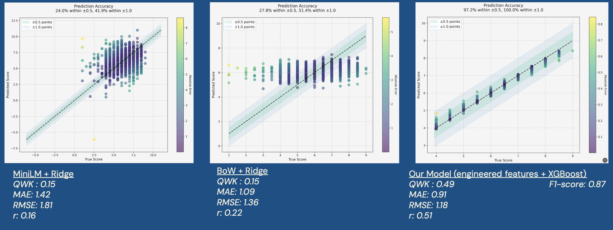
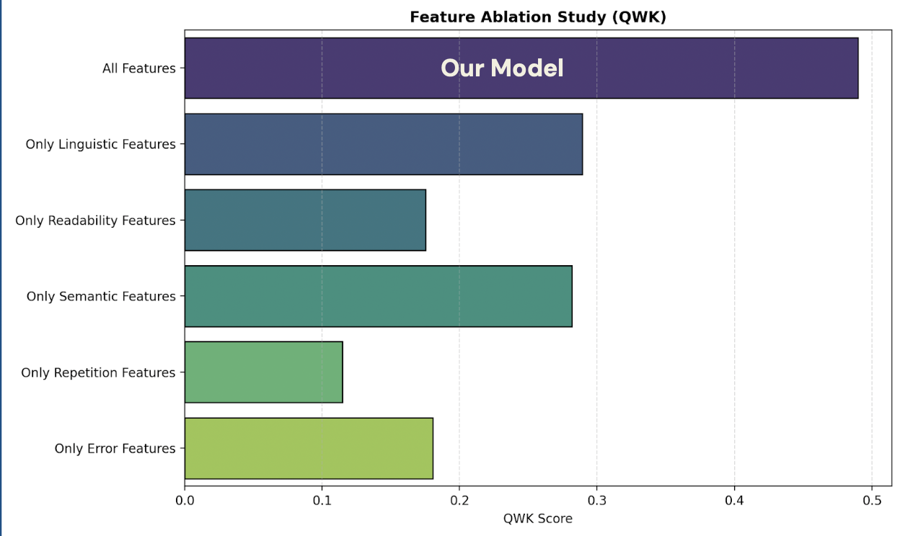
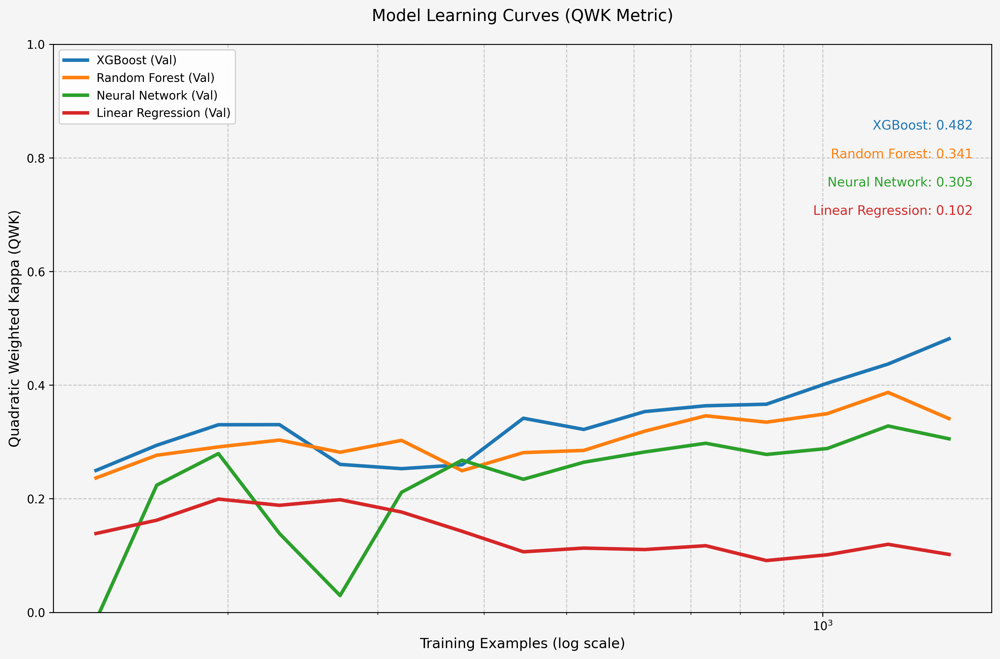

# Automated Essay Scoring Engine 

This project is an end-to-end ML application for automatic essay scoring based on the IELTS academic grading rubric.

---

## Results: 

Our model achieved a **QWK of 0.49** and **100% accuracy** within a 1.0 score band.

Our final model, an XGBoost regressor on our full feature set, significantly outperforms standard lexical (TF-IDF) and modern semantic (MiniLM Transformers) baselines. Our model's 0.49 QWK improves 227% on the 0.15 QWK achieved by the baselines. This proves the value of task-specific feature engineering for this problem.



---

## Method & Analysis

**1. Data**

We extracted numerical scores from detailed feedback on the scored IELTS academic corpus. We used 5000 essays along with their prompts and overall score bands to train our model. 

**2. Features**

We analyzed the importance of different feature categories. The study confirmed that our complete feature set ("All Features") was essential for achieving the best performance.

Our Features include:

**Linguistic:** Syntactic complexity, POS tag ratios, readability scores (Flesch).

**Lexical:** TF-IDF, word repetition, and lexical diversity metrics.

**Semantic:** BERT embeddings for prompt-essay similarity.

**Grammatical:** Custom rule-based error detection.




**3. Model Selection**

We compared several models on the task. The learning curves clearly show that XGBoost provided the most robust and highest-performing solution for this feature set.



**4. Final Model Precision**

The final model is highly precise, with 100% of predictions falling within the ±1.0 score band (see baseline prediction comparison plots).


---

## 🏃‍♀️ How to Run 
To run this project locally, please follow these steps. The recommended method is using Conda and the `environment.yml` file, as it guarantees the correct installation of PyTorch.

### Method 1: Using Conda (Recommended)

1.  **Clone the repository:**
    ```bash
    git clone https://github.com/mordvi9/Automated_Essay_Grading
    cd Automated_Essay_Grading
    ```
2.  **Create the Conda environment from the file:**
    This command will automatically create a new environment named `aes_project` with all the exact dependencies.
    ```bash
    conda env create -f environment.yml
    ```
3.  **Activate the new environment:**
    ```bash
    conda activate aes_project
    ```
4.  **Run the Streamlit app:**
    ```bash
    streamlit run src/app.py
    ```

### Method 2: Using Pip

This method should work in most cases but is more sensitive to existing system libraries.

1.  **Clone the repository and navigate into it.**

2.  **Create and activate a virtual environment:**
    ```bash
    python -m venv venv
    source venv/bin/activate  # On Windows, use `venv\Scripts\activate`
    ```
3.  **Install dependencies from `requirements.txt`:**
    ```bash
    pip install -r requirements.txt
    ```
4.  **Run the Streamlit app:**
    ```bash
    streamlit run src/app.py
    ```
---